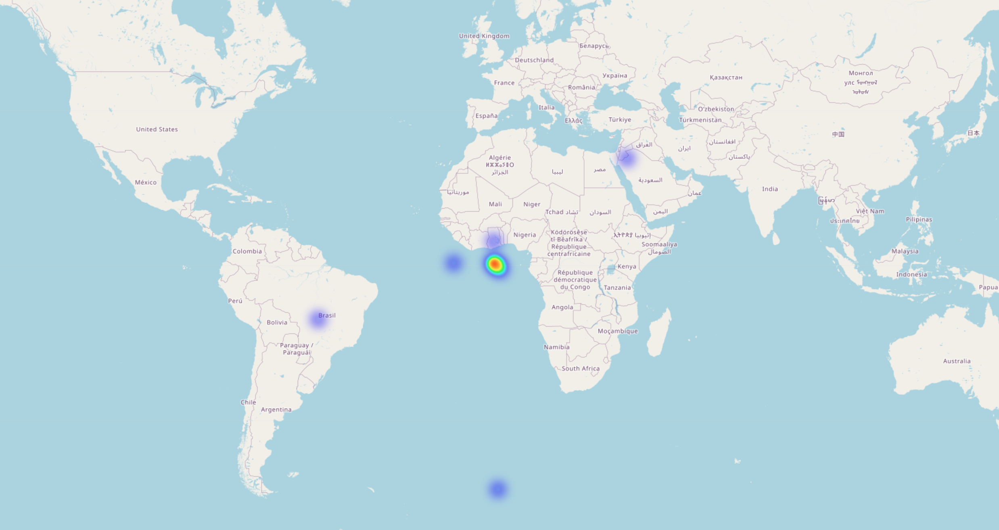
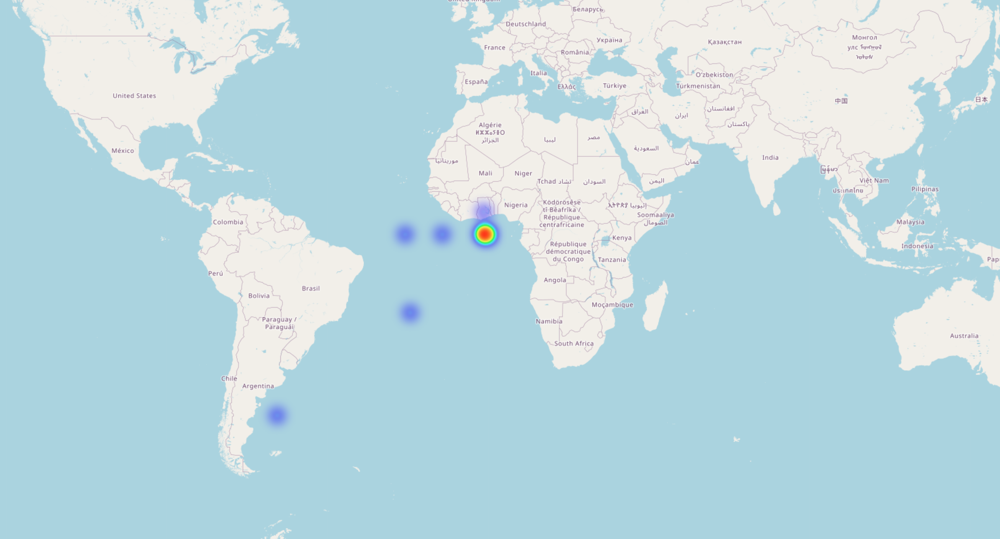

# FareSpot - Intelligent Taxi Fare Prediction


## Overview

FareSpot is an advanced machine learning solution for predicting taxi fares with high accuracy. Built with Django and powered by LightGBM regression models, this application provides reliable fare estimates based on trip details such as pickup/dropoff locations, time of day, and passenger count.

## Data Challenges Overcome

One of the biggest challenges in this project was dealing with problematic real-world data:

### Geolocation Inconsistencies

The heatmaps below illustrate one of our major data quality issues - many coordinates showed pickups and dropoffs in impossible locations such as oceans and lakes, despite the dataset being from the USA:

#### Pickup Locations Heatmap


#### Dropoff Locations Heatmap


Other significant data challenges included:
- Extreme outliers in fare amounts
- Missing values across multiple features
- Need for sophisticated scaling and encoding techniques

## Model Performance

After rigorous data cleaning and preprocessing, our model achieved excellent performance metrics:

| Metric | Value |
|--------|-------|
| R² Score | 0.7846 |
| MSE | 0.0429 |
| RMSE | 0.2070 |
| MAE | 0.1447 |

## Features

- **Accurate Fare Prediction**: Uses machine learning to provide reliable fare estimates
- **User-Friendly Interface**: Simple web interface for entering trip details
- **Geospatial Analysis**: Incorporates location data for improved predictions
- **Time-Based Factors**: Accounts for time of day and date in predictions
- **Robust Model**: Handles various input combinations with consistent results

## Project Structure

```
FareSpot/
├─ fare_prediction/           # Main application directory
│  ├─ models/                 # Trained ML models
│  │  ├─ lgb_model.pkl        # LightGBM model
│  │  └─ scaler.pkl           # StandardScaler preprocessor
│  ├─ templates/              # HTML templates
│  ├─ views.py                # View controllers
│  └─ urls.py                 # URL routing
├─ FareSpot/                  # Django project settings
├─ Heatmaps/                  # Geospatial visualization
│  ├─ Pickup_Heatmap.png      # Pickup location density map
│  └─ Dropoff_Heatmap.png     # Dropoff location density map
├─ Fare_Spot.png              # Project logo
├─ fare_prediction_pipeline.ipynb  # Model training notebook
├─ preprocessing_pipeline.ipynb    # Data preprocessing notebook
└─ manage.py                  # Django management script
```

## Technologies Used

- **Django**: Web framework for building the application interface
- **LightGBM Regressor**: Gradient boosting framework for the prediction model
- **StandardScaler**: Feature preprocessing for improved model performance
- **Jupyter Notebooks**: For data exploration and model development
- **Matplotlib/Seaborn**: For generating geospatial heatmaps

## Model Development Process

1. **Data Collection**: Gathered extensive taxi trip data
2. **Exploratory Data Analysis**: Identified patterns and anomalies
3. **Data Cleaning**: Addressed geolocation inconsistencies and outliers
4. **Feature Engineering**: Created relevant time-based and distance features
5. **Preprocessing**: Applied scaling and encoding techniques
6. **Model Selection**: Evaluated multiple regression models
7. **Hyperparameter Tuning**: Optimized LightGBM parameters
8. **Model Validation**: Ensured robust performance across various scenarios

## Setup Instructions

1. **Clone the repository**:
   ```bash
   git clone https://github.com/Spafic/FareSpot.git
   cd FareSpot
   ```

2. **Create a virtual environment**:
   ```bash
   python -m venv venv
   source venv/bin/activate  # On Windows: venv\Scripts\activate
   ```

3. **Install dependencies**:
   ```bash
   pip install -r requirements.txt
   ```

4. **Run migrations**:
   ```bash
   python manage.py migrate
   ```

5. **Start the server**:
   ```bash
   python manage.py runserver
   ```

6. **Access the application**:
   Open your browser and go to `http://127.0.0.1:8000/`

## Usage

1. Navigate to the home page
2. Enter trip details:
   - Pickup location (latitude/longitude)
   - Dropoff location (latitude/longitude)
   - Time and date
   - Number of passengers
3. Click "Predict Fare"
4. View the predicted fare amount

## Contributing

Contributions are welcome! Please fork the repository and submit a pull request.

## License

This project is licensed under the [MIT License](./LICENSE).

## Contact

For any inquiries, please contact:
- Email: [Email](mailto:omar.mamon203@gmail.com)
- GitHub: [Spafic](https://github.com/Spafic)
